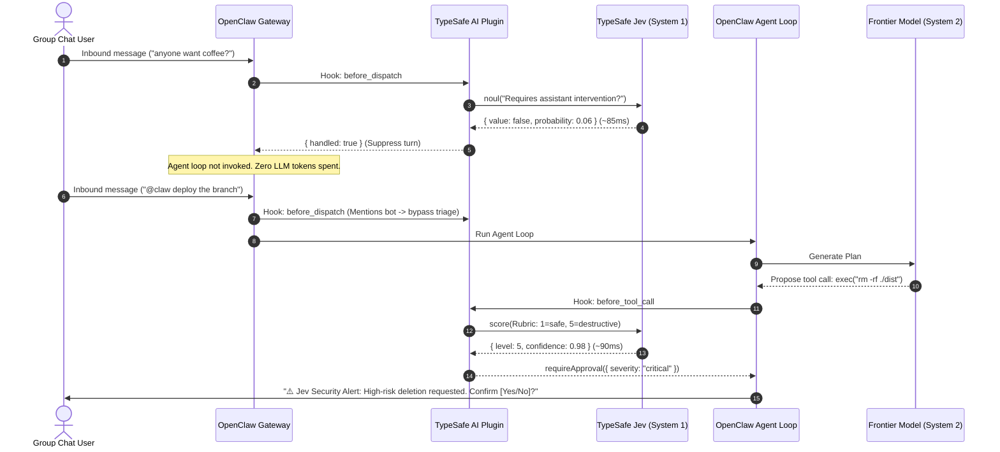

# OpenClaw TypeSafe AI Plugin (`@openclaw/plugin-typesafe-ai`)

[](https://opensource.org/licenses/MIT)
[](https://github.com/openclaw/openclaw)

An official community plugin integrating **TypeSafe AI's Jev** model into [OpenClaw](https://github.com/openclaw/openclaw).

Jev is the world's first **System One** model—optimized for sub-100ms, mathematically typed, zero-hallucination decisions. This plugin equips your OpenClaw agent with neural reflexes without modifying OpenClaw's core engine.

---

## ⚡ Why Use This Plugin?

Modern agent workflows often suffer from the **"Heuristic vs. Expensive LLM"** dilemma:

1. **Group Chat Fatigue**: In busy Discord/Slack/Telegram channels, OpenClaw either misses conversations (`/activation mention`) or burns tokens on every casual message (`/activation always`).
2. **Tool Execution Blindspots**: Static allowlists (`exec`, `fs_write`) can't tell whether `exec("git status")` is harmless or `exec("rm -rf /")` is catastrophic.
3. **Model Cost Blowouts**: Routing every simple greeting or status query to expensive frontier models (Claude 3.5 Sonnet, GPT-4o) wastes money and adds unnecessary latency.

**TypeSafe Jev solves this in 70–150ms at $0.042 per million input tokens (with output tokens free).**

---

## 🎯 Features

* 🤫 **Intelligent Group Chat Triage (`Noul`)**: Evaluates inbound group messages in `before_dispatch` in ~80ms. Casual chatter is suppressed immediately before context assembly or agent loops wake up.
* 🛡️ **Autonomous Tool Blast Radius Guardrails (`Score`)**: Evaluates proposed tool execution parameters on a calibrated 1–5 risk scale. Harmless actions run instantly; destructive commands escalate for operator approval with fail-closed protection.
* ⚡ **In-Memory LRU Decision Cache**: Deterministic SHA-256 fingerprinting caches tool safety ratings, delivering 0ms instant verdicts on repetitive commands (`git status`, `ls`, file reads).
* 🧹 **Pre-Compaction Tool Output Curation (`Choice` & `Noul`)**: Concurrently prunes bloated, transient tool outputs (test traces, terminal logs) in parallel batches before history reaches the LLM summarizer—slashing compaction input by ~75% while preserving state.
* 🔍 **Post-Compaction Fidelity Auditing (`Noul`)**: Audits the resulting compacted summary against original conversation goals to actively verify no critical tasks or user constraints were lost in compression.
* 🧰 **Manual Agent Tools (`typesafe_evaluate`, `typesafe_jev`)**: Exposes direct, on-demand Jev System One evaluation tools to your agent. Even when all automated event hooks are disabled, the plugin remains active and provides explicit System One decision tools.
* 🔌 **Outage-Proof Circuit Breaker**: Consecutive network failures trip a circuit breaker to immediately fail fast, eliminating latency stalls during downstream provider interruptions.
* 🔀 **Adaptive Model Tier Routing (`Choice`)**: Dynamically routes trivial queries to fast utility models (e.g. Claude 3.5 Haiku) and reserves frontier reasoning models for complex tasks.
* 🛑 **Prompt Injection Screening (`Score`)**: Audits untrusted external web scraping and email payloads before feeding them to the primary agent loop.
* 🔒 **Zero-Core Footprint & Graceful Fallback**: Strictly opt-in. If unconfigured or if network blips occur, OpenClaw transparently falls back to safe behavior with zero interruptions.

---

## 📦 Installation

### Option 1: Install via ClawHub / OpenClaw CLI (Recommended)
```bash
openclaw plugins install openclaw-plugin-typesafe-ai
```

### Option 2: Local Development Link
Clone this repository and link it into your OpenClaw workspace:
```bash
git clone https://github.com/jason-allen-oneal/openclaw-plugin-typesafe-ai.git
cd openclaw-plugin-typesafe-ai
pnpm install
pnpm run build
pnpm link

# Inside your OpenClaw workspace:
openclaw plugins link openclaw-plugin-typesafe-ai
```

---

## ⚙️ Configuration

Set your TypeSafe AI API key in your `.env` file:
```env
TYPESAFE_API_KEY=ts_live_your_key_here
```

Or configure it in your `openclaw.json` (or Gateway settings):
```json
{
  "plugins": {
    "entries": {
      "typesafe-ai": {
        "enabled": true,
        "config": {
          "apiKey": "${TYPESAFE_API_KEY}",
          "timeoutMs": 1500,
          "safetyFailMode": "secure",
          "cacheEnabled": true,
          "triageThreshold": 0.75,
          "safetyApprovalLevel": 4,
          "compactionConcurrency": 5,
          "features": {
            "groupChatTriage": true,
            "toolSafetyGate": true,
            "compactionCuration": true,
            "compactionFidelityAudit": true,
            "modelComplexityRouting": false,
            "promptInjectionAudit": false
          }
        }
      }
    }
  }
}
```

### Configuration Options

| Option | Type | Default | Description |
| :--- | :--- | :--- | :--- |
| `apiKey` | `string` | `process.env.TYPESAFE_API_KEY` | TypeSafe AI API key. |
| `timeoutMs` | `number` | `1500` | Maximum ms to wait for a Jev decision before falling back. |
| `safetyFailMode` | `string` | `"secure"` | Safety fallback: `"secure"` fails closed (requires operator approval for dangerous tools on error); `"permissive"` allows normal execution. |
| `cacheEnabled` | `boolean` | `true` | In-memory LRU decision cache for deterministic tool safety ratings. |
| `cacheTtlMs` | `number` | `900000` (15m) | Time-to-live for cached decisions in milliseconds. |
| `cacheMaxEntries` | `number` | `500` | Maximum cache capacity before LRU eviction. |
| `circuitBreakerFailureThreshold` | `number` | `3` | Consecutive failures before tripping the circuit breaker to OPEN. |
| `circuitBreakerResetTimeoutMs` | `number` | `30000` (30s) | Cooldown before attempting probe request in HALF_OPEN state. |
| `compactionConcurrency` | `number` | `5` | Maximum concurrent tool evaluations during pre-compaction pruning. |
| `triageThreshold` | `number` | `0.75` | Confidence threshold ($0.0 - 1.0$) to suppress group chatter. |
| `safetyApprovalLevel`| `number` | `4` | Risk score ($1 - 5$) at or above which interactive operator approval is requested. |
| `botNames` | `string[]` | `["assistant", "bot", ...]` | Bot aliases to always exempt from chatter suppression. |
| `features.groupChatTriage` | `boolean` | `true` | Enable sub-100ms group chat triage via `Noul`. |
| `features.toolSafetyGate` | `boolean` | `true` | Enable pre-flight blast radius tool checks via `Score`. |
| `features.compactionCuration` | `boolean` | `true` | Enable pre-compaction tool output pruning via `Choice`. |
| `features.compactionFidelityAudit` | `boolean` | `true` | Audit post-compaction session generation against initial goals. |
| `features.modelComplexityRouting` | `boolean` | `false` | Enable dynamic model tier selection via `Choice`. |
| `features.promptInjectionAudit` | `boolean` | `false` | Enable prompt injection screening via `Score`. |

---

## 🧰 Manual Agent Tools

The plugin registers two agent tools: `typesafe_evaluate` (and alias `typesafe_jev`). These tools allow the agent to run manual, on-demand Jev decisions even if all automatic hooks are turned off:

- **`noul`**: Evaluate a binary proposition (`state`, `proposition`) returning `{ value: boolean, probability: number, confidence: number }`.
- **`choice`**: Select among candidate options (`state`, `instructions`, `options`, `criteria`).
- **`score`**: Grade state against a rubric (`state`, `instructions`, `rubric`).
- **`systemOne`**: Execute a batch of typed questions across noul, choice, and score in parallel.

---

## 🏗️ Architecture



---

## 🛠️ Development & Testing

```bash
# Install dependencies
npm install

# Run unit tests (with vitest)
npm test

# Type check
npm run typecheck

# Build distribution bundle
npm run build
```

---

## 📄 License

MIT License. See [LICENSE](LICENSE) for details.
